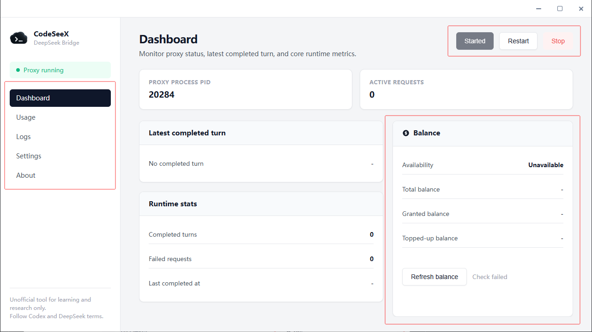
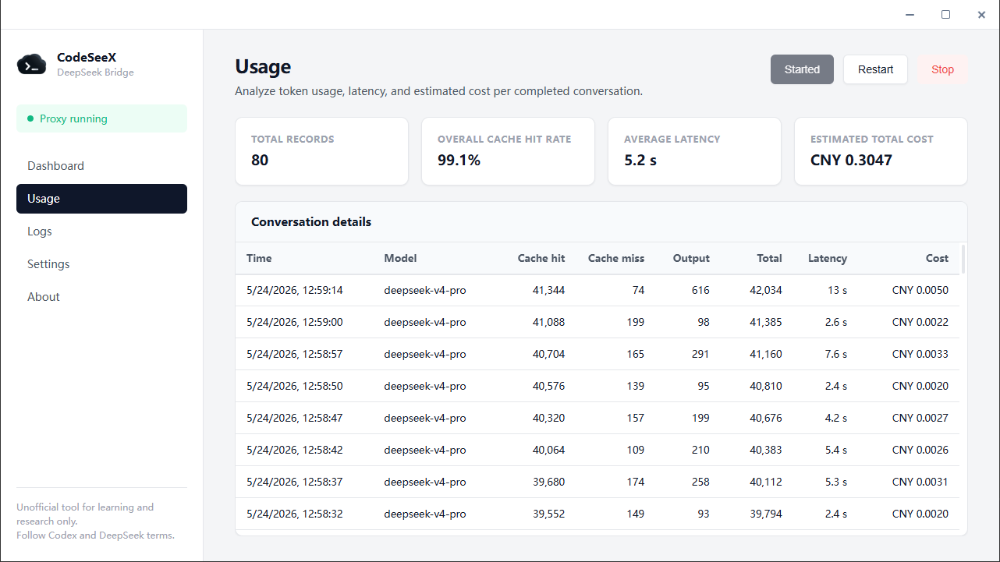
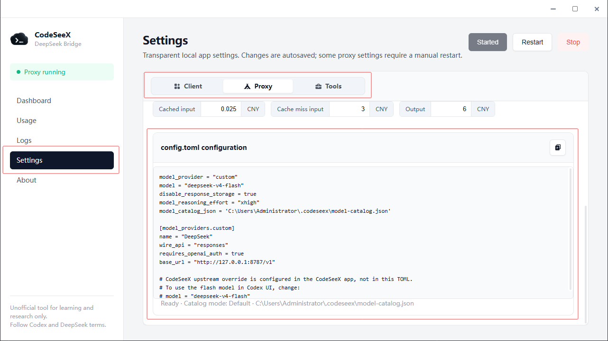

# Screenshots

The primary current desktop screenshot is used in the README:

Additional product screenshots are kept here for documentation context:

The adapter settings screenshot below shows an earlier desktop layout. Prefer the generated TOML shown by the current CodeSeeX app for real setup.

